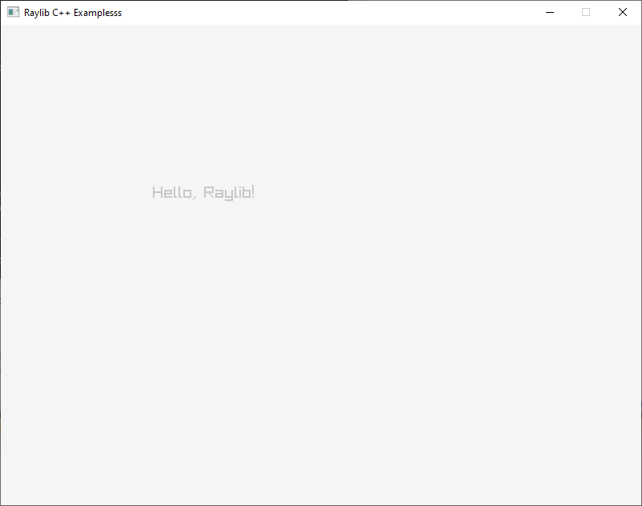

```cpp
#include "raylib.h"

int main()
{
	InitWindow(800, 600, "Raylib C++ Example");	

	while (!WindowShouldClose())
	{
		BeginDrawing();
		ClearBackground(RAYWHITE);
		DrawText("Hello, Raylib!", 190, 200, 20, LIGHTGRAY);
		EndDrawing();
	}

	CloseWindow();              // Close window and OpenGL context	

	return 0;
}
```

# OR

```cpp
#include "raylib.h"

int main()
{
	const int screenWidth = 800;
	const int screenHeight = 600;
	const char title[] = "Raylib C++ Examplesss";

	InitWindow(screenWidth, screenHeight, title);	

	while (!WindowShouldClose())
	{
		BeginDrawing();
		ClearBackground(RAYWHITE);
		DrawText("Hello, Raylib!", 190, 200, 20, LIGHTGRAY);
		EndDrawing();
	}

	CloseWindow();              // Close window and OpenGL context	

	return 0;
}
```

