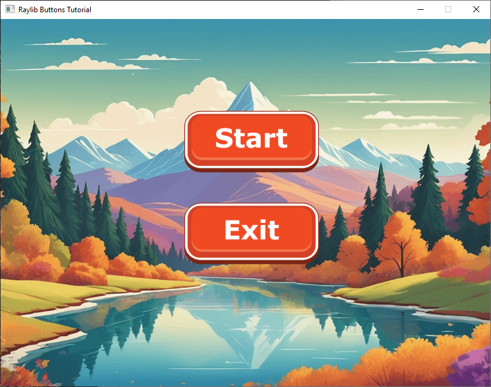

`button.h`

```cpp
#pragma once
#include "raylib.h"

class Button
{
public:
    Button(const char* imagePath, Vector2 imagePosition, float scale);
    ~Button();

    void Draw();
    bool isPressed(Vector2 mousePos, bool mousePressed);

private:
    Texture2D texture;
    Vector2 position;
};
```

`button.cpp`
```cpp
#include "Button.h"

Button::Button(const char* imagePath, Vector2 imagePosition, float scale)
{
    Image image = LoadImage(imagePath);

    int newWidth = static_cast<int>(image.width * scale);
    int newHeight = static_cast<int>(image.height * scale);

    ImageResize(&image, newWidth, newHeight);
    texture = LoadTextureFromImage(image);

    UnloadImage(image);
    position = imagePosition;
}

Button::~Button()
{
    UnloadTexture(texture);
}

void Button::Draw()
{
    DrawTextureV(texture, position, WHITE);
}

bool Button::isPressed(Vector2 mousePos, bool mousePressed)
{
    Rectangle rect{
        position.x,
        position.y,
        (float)texture.width,
        (float)texture.height
    };

    return CheckCollisionPointRec(mousePos, rect) && mousePressed;
}
```

`main.cpp`
```cpp
#include <raylib.h>
#include <iostream>
#include "button.h"

int main()
{
    InitWindow(800, 600, "Raylib Buttons Tutorial");

    SetTargetFPS(60);

    Texture2D background = LoadTexture("Graphics/background.png");
    Button startButton{ "Graphics/start_button.png", {300, 150}, 0.65 };
    Button exitButton{ "Graphics/exit_button.png", {300, 300}, 0.65 };
    bool exit = false;

    while (WindowShouldClose() == false && exit == false)
    {
        Vector2 mousePosition = GetMousePosition();
        bool mousePressed = IsMouseButtonPressed(MOUSE_BUTTON_LEFT);

        if (startButton.isPressed(mousePosition, mousePressed))
        {
            std::cout << "Start Button Pressed" << std::endl;
        }

        if (exitButton.isPressed(mousePosition, mousePressed))
        {
            exit = true;
        }

        BeginDrawing();
        ClearBackground(BLACK);
        DrawTexture(background, 0, 0, WHITE);
        startButton.Draw();
        exitButton.Draw();
        EndDrawing();
    }
    CloseWindow();
}
```

