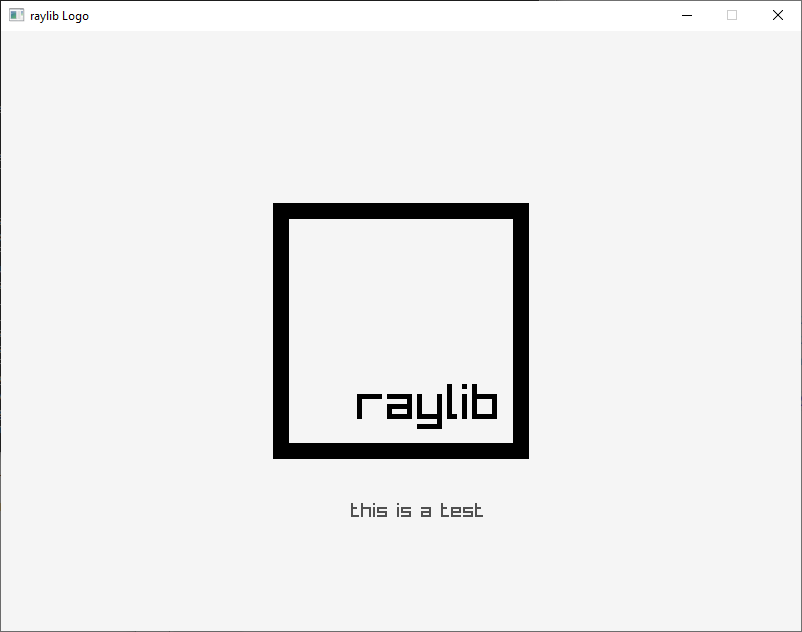

```cpp
#include <raylib.h>

int main()
{
	const int screenWidth = 800;
	const int screenHeight = 600;

    InitWindow(screenWidth, screenHeight, "raylib Logo");

    SetTargetFPS(60);    

    while (WindowShouldClose() == false)
    {
		BeginDrawing();
        
		ClearBackground(RAYWHITE);

		DrawRectangle(screenWidth/2 - 128, screenHeight / 2 - 128, 256, 256, BLACK);
		DrawRectangle(screenWidth/2 - 112, screenHeight / 2 - 112, 224, 224, RAYWHITE);
		DrawText("raylib", screenWidth / 2 - 44, screenHeight / 2 + 48, 50, BLACK);

		DrawText("this is a test", 350, 470, 20, DARKGRAY);

        EndDrawing();
    }
    CloseWindow();
}
```

